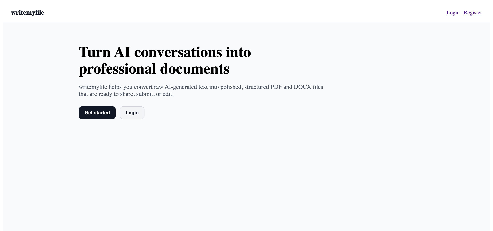

# ✍️ writemyfile

Convert AI-generated conversations into clean, structured, professional documents — exportable as PDF and DOCX.

## 🚀 Live Demo

Frontend: https://writemyfile.netlify.app



---

## ✨ Features

- 🔐 Authentication (Register / Login)
- 📄 Create documents from raw AI text
- 🧠 Automatic content structuring
- ✏️ Edit existing documents
- 🗑️ Delete documents
- 📥 Export as PDF
- 📥 Export as DOCX
- ⚡ Fast and minimal UI

---

## 🧱 Tech Stack

### Frontend

- React + Vite + TypeScript
- Axios

### Backend

- Node.js + Express + TypeScript
- MongoDB (Typegoose)

### Deployment

- Frontend: Netlify
- Backend: Render
- Database: MongoDB Atlas

---

## 🛠️ Local Development

### 1. Clone the repo

```bash
git clone https://github.com/farhanabsar21/writemyfile-app.git
cd writemyfile
```

### 2. Setup backend

```bash
cd server
npm install
```

- Create `.env`:

```bash
PORT=5000
NODE_ENV=development
MONGO_URI=your_mongodb_uri
JWT_SECRET=your_secret
CLIENT_URL=http://localhost:5173
```

- Run backend:

```bash
npm run dev
```

### 3. Setup frontend

```bash
cd client
npm install
```

- Create `.env`:

```bash
VITE_API_URL=http://localhost:5000/api/v1
```

- Run frontend:

```bash
npm run dev
```

### 🔐 Environment Variables

```bash
## Backend
PORT
MONGO_URI
JWT_SECRET
CLIENT_URL
```

```bash
## Frontend
VITE_API_URL
```

### 📦 Production URLs

- **Frontend:** https://writemyfile.netlify.app
- **Backend:** https://writemyfile-app.onrender.com

### 📌 Future Improvements

- AI-powered formatting improvements
- Template previews
- Document sharing
- Custom styling options
- Payment integration
